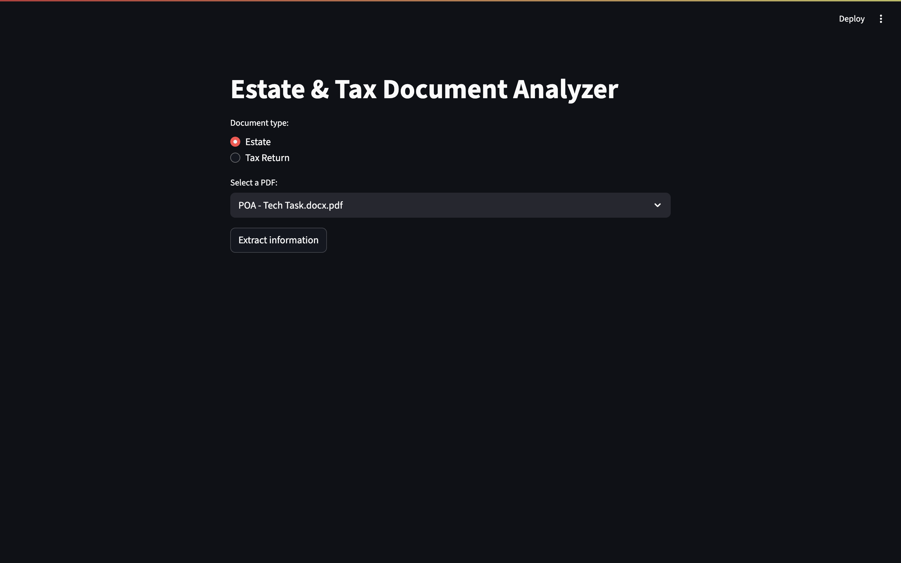

# Estate and Tax Document Analyzer - FP Alpha Technical Assesment

This repository contains a Python application with a Graphical User Interface (GUI) that allows the user to select either an Estate or Tax Return PDF document and the program will return information from these documents.

## Objective 

Extract certain information for each type of document, if the user selected an Estate document, an LLM (OpenAI GPT) will look for:

- Title
- Document Date
- Client Name
- Governing Law (State)
- Named agent/attorney-in-law
- Summary of the document content
- Number of pages

If the user selected a Tax Return document, with OCR it will look for the required ID's and extract the amount related to those ID's

## Project Structure

```Directory structure:
└──ESTATE-AND-TAX-DOCUMENT-ANALYZER/
    └─ docs/ → sample PDFs for local testing
        ├─ estate/ → Power-of-Attorney example
        └─ tax/ → Tax-return example
    └─ modules / → Core library code
        ├─ ocr_utils.py → PDF to image, OCR helpers
        ├─ poa_extractor.py → POA extraction
        └─ tax_extractor.py → Tax Return extraction
    ├─ prompts/ → Prompt templates for the LLM
    ├─ app.py → Streamlit GUI
    ├─ .gitignore
    ├─ .python-version
    ├─ pyproject.toml 
    ├─ uv.lock 
    └─ README.md
```
## Technologies

- Python
- OpenAI
- Pdfplumber
- Pdf2image
- Tesseract
- Regex
- Streamlit
- Pandas

## Steps to execute the project

1. **Clone the repository.**  
   Make a fork and clone it on your local machine:

```bash
git clone https://github.com/your-user/axl2301-Estate-and-Tax-Document-Analyzer.git
cd Estate-and-Tax-Document-Analyzer
```
2. **Virtual environment and Dependencies**

Make sure you have Python and uv installed, then run

```bash
uv venv
source .venv/bin/activate
uv sync
```

Install tesseract in your system (in case you don't have it)
```bash
brew install tesseract
```

3. **Set your API Key**
```bash
echo OPENAI_API_KEY = sk- . . . >> .env
```

4. **Run Streamlit GUI**

Open your terminal and run

```bash
streamlit run app.py
```

Then visit localhost on your browser

## How it works

- **Estate extractor**: Full text is pushed to GPT-4o-mini with a carefully crafted prompt. The model returns the expected keys, plus a ≤ 100-word summary.
- **Tax Return extractor**: 
    1. Each page is passed through Tesseract to get word locations.
    2. Searches for IDs by geometric rules (IDs listed in FIELDS)
    3. Extracts the amount related to those IDs (*Left side box support exists but is not 100 % reliable; minor tweaks to thresholds may be required*)

## GUI Demo

1. Pick Estate or Tax Return
2. Select a sample file
3. Click **Extract information**
    - Estate: A table with the extracted metadata appears, followed by the LLM summary.
    - Tax Return: A table shows the IDs and its amount
4. JSON output is available for download in both cases




